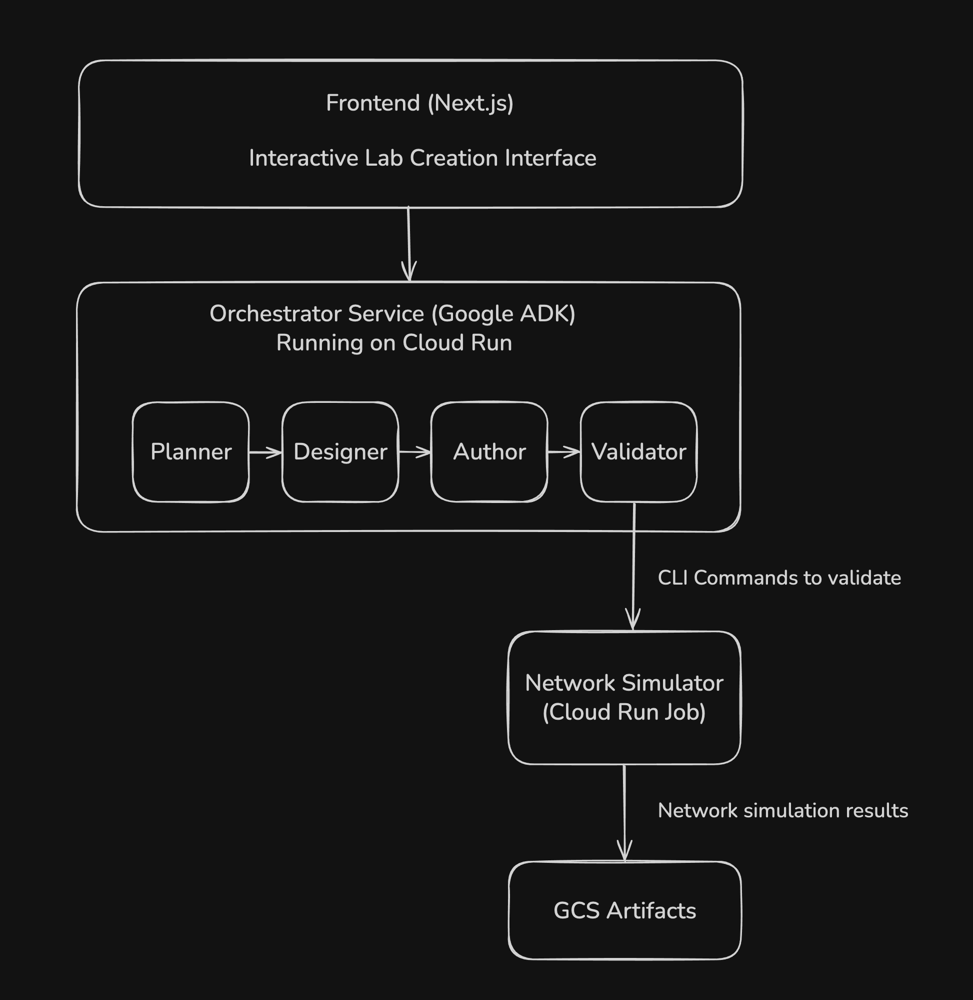
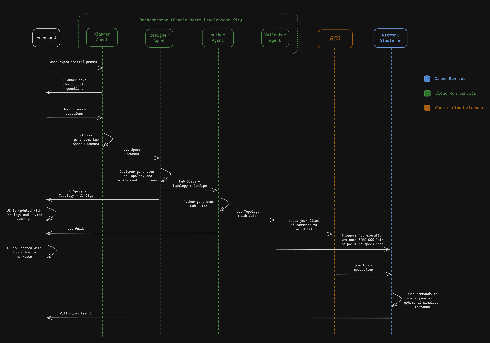

# NetGenius Instructor Copilot (NIC)

**AI-Powered Networking Lab Generator Built with Google's Agent Development Kit (ADK)**

## Overview

NetGenius Instructor Copilot (NIC) leverages **Google's Agent Development Kit (ADK)** to orchestrate multiple specialized AI agents that automate the full lifecycle of networking lab creation:

- **Planning** learning objectives through interactive multi-turn Q&A (ADK LlmAgent)
- **Designing** network topology and configurations with tool integration (ADK LlmAgent with tools)
- **Authoring** student-facing lab guides with markdown formatting (ADK LlmAgent)
- **Validating** labs via headless simulation (ADK Custom Agent)
- **Publishing** final, solvable lab materials

Built using Google ADK's multi-agent orchestration patterns powered by Gemini 2.5 Flash as the underlying LLM.

## Architecture



> **Note:** For a more detailed diagram showing the exact interaction between each component, including data structures and sequence flow, see the [Detailed Workflow](#detailed-workflow) section below.

## Repository Structure

This repository contains **only the open-source orchestrator**. The validation and simulation service (referred to as headless runner in this README) is maintained in a separate private repository.

### This Repository (Public)

```
cloud-run-hackathon/
├── orchestrator/          # ADK-based multi-agent orchestrator
│   ├── adk_agents/       # Planner, Designer, Author, Validator agents
│   ├── tools/            # Tool wrappers for private services
│   └── schemas/          # Data models for agent communication
├── frontend/             # Next.js web interface
│   ├── components/       # React components for lab creation UI
│   └── app/             # Next.js app router pages
├── docs/                 # API documentation
│   └── headless-runner-api.md   # Headless Runner API contract
├── infra/                # GCP infrastructure and deployment
│   └── scripts/          # Setup and deployment scripts
├── examples/             # Sample labs and payloads
│   └── static-routing/   # Example static routing lab
└── README.md             # This file
```

### Private Repositories (Not Included)

**netgenius-headless-runner** (Private)

- Network simulation execution engine
- Proprietary simulator integration
- GCS artifact generation
- Deployed as Cloud Run Job

## Components

| Component           | Description                             | Visibility         | Deployment        |
| ------------------- | --------------------------------------- | ------------------ | ----------------- |
| **Frontend**        | Next.js web interface for lab creation  | Public (this repo) | Vercel            |
| **Orchestrator**    | Multi-agent coordination via Google ADK | Public (this repo) | Cloud Run Service |
| **Headless Runner** | Simulation execution in Cloud Run Jobs  | Private            | Cloud Run Job     |

## API Documentation

The Headless Runner source code is private, but its API contract is fully documented:

- [Headless Runner API Reference](docs/headless-runner-api.md) - Job payload and artifact formats

The orchestrator integrates with the Headless Runner via a well-defined job execution interface.

## Quick Start

### Prerequisites

- Python 3.11+
- Node.js 18+
- Google Gemini API key ([Get one here](https://aistudio.google.com/app/apikey))
- Google Cloud SDK (optional, only needed for validation features)

### Running Locally

1. **Configure environment variables:**

```bash
cd orchestrator
cp .env.example .env
```

Edit `.env` and add your Google Gemini API key:

```bash
GOOGLE_API_KEY=your_google_api_key_here
```

**Required environment variables:**

- `GOOGLE_API_KEY` - Your Google Gemini API key (required for all AI agents)

**Optional environment variables** (only needed for Cloud Run Job validation):

- `GCP_PROJECT_ID` - Your GCP project ID (default: `netgenius-hackathon`)
- `REGION` - GCP region (default: `us-central1`)
- `GCS_BUCKET` - GCS bucket for artifacts (default: `netgenius-artifacts-dev`)
- `PORT` - Server port (default: `8080`)

2. **Start the orchestrator:**

```bash
cd orchestrator
python -m venv venv
source venv/bin/activate  # or `venv\Scripts\activate` on Windows
pip install -r requirements.txt
python api_server.py
```

The orchestrator will start on http://localhost:8080

3. **Start the frontend:**

```bash
cd frontend
npm install
npm run dev
```

The frontend will start on http://localhost:3000

4. **Access the application:**

Open http://localhost:3000 in your browser.

**Note:** The validation stage requires access to the private Headless Runner service. For local development and testing, the planner, designer, and author agents will work without it.

### Deploying to Production

The Headless Runner service must be built and deployed from its private repository before running the orchestrator.

1. **Deploy Headless Runner:**

```bash
# In netgenius-headless-runner repository (private)
gcloud builds submit --tag=us-central1-docker.pkg.dev/PROJECT/netgenius/headless-runner

# Then in this repository
./infra/scripts/deploy-headless-runner.sh
```

## GCP Infrastructure Setup

```bash
# Set up GCP project, service accounts, GCS, Artifact Registry
./infra/scripts/setup-gcp.sh

# Deploy Headless Runner (after building private image)
./infra/scripts/deploy-headless-runner.sh
```

## Testing

The application can be tested through the web interface at http://localhost:3000. You'll see ADK's multi-agent orchestration in action:

1. Enter a lab description (e.g., "Create a basic static routing lab")
2. Interact with the Planner agent's multi-turn conversation
3. Watch ADK coordinate the agent pipeline:
   - Planner: Gathers requirements via conversational Q&A
   - Designer: Creates topology and configurations with tool validation
   - Author: Writes the lab guide using structured output
   - Validator: Runs headless simulation through custom integration

## Documentation

- [PRD.md](PRD.md) - Product Requirements Document
- [IMPLEMENTATION_PLAN.md](IMPLEMENTATION_PLAN.md) - Detailed implementation guide
- [docs/headless-runner-api.md](docs/headless-runner-api.md) - Headless Runner API

## How It Works

### Google ADK Multi-Agent Workflow

The orchestrator leverages **Google ADK's agent orchestration capabilities** to coordinate specialized AI agents in a sequential pipeline:

1. **Pedagogy Planner** (`LlmAgent`) - Engages in multi-turn Q&A conversations to gather complete lab requirements using ADK's session management
2. **Designer** (`LlmAgent` with tools) - Creates network topology and configurations, utilizing ADK's tool integration patterns to validate outputs
3. **Lab Guide Author** (`LlmAgent`) - Writes step-by-step student instructions with markdown, leveraging ADK's structured output capabilities
4. **Validator** (Custom `BaseAgent`) - Executes headless simulation to verify lab is solvable, demonstrating ADK's extensibility for custom integrations

Each agent communicates through ADK's **session state**, enabling seamless data flow between agents without manual state management. The entire pipeline is orchestrated using ADK's `SequentialAgent` pattern, providing automatic error handling and retry logic.

### Headless Runner (Private Service)

Executes complete lab simulation in isolated Cloud Run Job:

- Applies initial configurations
- Runs student steps
- Executes verification commands
- Captures device histories and artifacts
- Writes results to GCS

See [API Documentation](docs/headless-runner-api.md) for details.

## Detailed Workflow

The following diagram shows the complete end-to-end flow, including interactive Q&A, data structures passed between agents, and the Cloud Run Job integration:



**Key highlights:**

1. **Planner Agent** conducts multi-turn Q&A with the user to gather requirements
2. **Designer Agent** generates topology YAML and device configurations
3. **Author Agent** creates the lab guide with step-by-step instructions
4. **Validator Agent** packages everything into `specs.json`, uploads to GCS, and triggers the Cloud Run Job
5. **Network Simulator** (Headless Runner) downloads the spec, runs the simulation, and uploads validation results back to GCS
6. **Validator Agent** polls GCS for results and returns success/failure to the orchestrator

## Intelligent Auto-Retry System (RCA Agent)

### Vision

One of the most challenging aspects of automated lab generation is handling validation failures. When a lab fails headless validation, determining **what went wrong** and **which agent should fix it** requires intelligent analysis. The RCA (Root Cause Analysis) agent addresses this by automatically diagnosing validation failures and orchestrating targeted fixes.

### How It Works

The RCA system consists of two ADK agents working in tandem:

**1. RCA Agent (`create_rca_agent()`)**

This `LlmAgent` analyzes validation failures and classifies them into three categories:

- **DESIGN** - Topology or configuration issues (e.g., missing interfaces, incorrect IP addressing)

  - Routes fix back to: **Designer agent**
  - Example: "Interface GigabitEthernet0/1 not configured on R1"

- **INSTRUCTION** - Lab guide errors (e.g., wrong commands, missing steps, incorrect verification)

  - Routes fix back to: **Author agent**
  - Example: "Command `show ip route static` should be `show ip route` for verification"

- **OBJECTIVES** - Specification issues requiring human judgment (e.g., unrealistic time estimates, scope problems)
  - Routes to: **Human escalation**
  - Example: "Lab requires 90 minutes but spec estimates 30 minutes"

The RCA agent outputs a **PatchPlan** structured as:

```json
{
  "root_cause_type": "DESIGN",
  "analysis": "Detailed explanation of what went wrong",
  "target_agent": "designer",
  "patch_instructions": "Specific guidance for the Designer to fix the issue",
  "should_retry": true,
  "confidence": "high"
}
```

**2. Patch Router Agent (`create_patch_router_agent()`)**

This `LlmAgent` takes the PatchPlan and routes it to the appropriate agent:

- **If `target_agent == "designer"`**: Triggers Designer with patch instructions to regenerate topology/configs
- **If `target_agent == "author"`**: Triggers Author with patch instructions to revise lab guide
- **If `target_agent == "planner"`**: Escalates to human (OBJECTIVES issues require instructor approval)

### ADK Implementation

The RCA system showcases ADK's multi-agent orchestration capabilities:

```python
# From orchestrator/adk_agents/rca.py

def create_rca_agent() -> LlmAgent:
    """Analyzes validation failures and creates patch plans."""
    return LlmAgent(
        model="gemini-2.5-flash",
        name="RCAAgent",
        description="Analyzes validation failures and creates patch plans",
        instruction="""
Analyze validation failure and classify root cause:
- DESIGN: Topology/config issues → Designer
- INSTRUCTION: Lab guide errors → Author
- OBJECTIVES: Spec problems → Human
        """,
        output_key="patch_plan",
    )

def create_patch_router_agent() -> LlmAgent:
    """Routes patch plans to appropriate agents for fixes."""
    return LlmAgent(
        model="gemini-2.5-flash",
        name="PatchRouterAgent",
        description="Routes patch plans to appropriate agents",
        instruction="Route based on target_agent field in patch_plan",
        output_key="patch_result",
    )
```

The system uses ADK's session state to maintain context across retries, enabling intelligent iteration until validation passes or maximum retries are reached.

### Why It's Not in the UI (Yet)

The RCA agent system is **fully implemented** in the backend (`orchestrator/adk_agents/rca.py`) and **working**, but is not exposed in the frontend UI due to hackathon time constraints.

**Current state:**

- ✅ RCA agent implementation complete
- ✅ Patch router implementation complete
- ✅ PatchPlan schema defined
- ✅ Integration with Designer and Author agents ready
- ❌ Frontend UI for retry progress not implemented
- ❌ User controls for max retries not added
- ❌ Retry visualization not built

**What's needed to expose it:**

1. Frontend UI to show retry attempts and RCA analysis
2. User controls for enabling/disabling auto-retry
3. Progress indicators showing which agent is being re-invoked
4. Display of patch instructions and confidence levels

### Future Plans

In the short term, we plan to:

1. **Add Retry UI**: Display RCA analysis and retry progress in the frontend
2. **User Controls**: Let instructors set max retry attempts (default: 3)
3. **Confidence Thresholds**: Only auto-retry on "high" confidence classifications
4. **Retry History**: Show evolution of lab across retry iterations

This feature demonstrates ADK's power in building sophisticated multi-agent systems with intelligent error recovery—a critical capability for production AI applications.

## License

**Frontend & Orchestrator:** MIT License (open-source)
**Headless Runner:** Proprietary (closed-source)

## Hackathon Details

**Event:** Google Cloud Run Hackathon
**Team:** Rafael Campos
**Category:** AI-Powered Automation
**Stack:** Google ADK (Gemini 2.5 Flash) + FastAPI + Next.js + Cloud Run + Cloud Run Jobs

NetGenius Instructor Copilot demonstrates how **Google's Agent Development Kit (ADK)** combined with Cloud Run enables scalable, event-driven AI agent orchestration. The application showcases ADK's multi-agent coordination patterns (LlmAgent, custom agents, session management) running seamlessly on Cloud Run Services, with validation workloads executing as Cloud Run Jobs.

---

For questions or issues, please open a GitHub issue in this repository.
